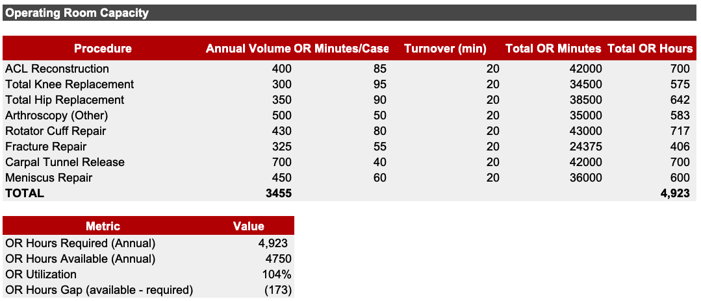

# Orthopedics Service Line Budget & Performance Model (HOPD)
FY2026 Budget vs FY2025 Actual | Margin, Capacity, Break-Even, Productivity & Payor Mix  

## Executive Summary

This project is a driver-based operating budget and performance model for an Orthopedics hospital outpatient department (HOPD). The goal is to show how the service line’s financial performance is created (or lost) through a small set of core drivers—surgical and clinic volumes, payor yield (net-to-gross), cost behavior (variable vs fixed), and operational capacity constraints. Instead of treating the budget as a static set of totals, the model is designed to “explain” the totals and make them usable for decision-making.

The FY2026 budget projects total net revenue of $54.4M, up 1.4% versus FY2025 actuals, while total operating expenses rise 1.8% to $52.7M. That small mismatch is enough to compress profitability: net operating income declines from $1.89M to $1.75M and the operating margin falls from 3.52% to 3.21%. The model makes it clear that this is not a revenue problem—it is primarily a cost and throughput problem. Surgical volume grows, and surgical revenue increases, but medical supplies rise sharply (+10.9%, +$1.04M), consuming most of the incremental revenue and pushing the budgeted margin lower.

Operationally, the budget also carries an important warning: the plan requires more OR time than the assumed capacity. Total OR hours required (4,923) exceed available OR hours (4,750), implying utilization of 104% and a shortfall of 173 hours per year. In other words, the service line is budgeting growth in cases without fully budgeting the operational capacity required to deliver that growth under the current assumptions (case time + turnover). This gap is the kind of issue that usually shows up later as overtime, delays, staffing stress, or lost volume—so surfacing it in the budget stage is one of the main reasons this model exists.

Finally, the procedure-level margin view shows that profitability is concentrated and uneven once costs and facility allocation assumptions are applied. Some procedures generate large positive contribution after allocation, while others become meaningfully negative.

## What the Model Includes

This is a driver-based Orthopedics HOPD budget model that connects volume, payor mix (yield, net-to-gross), costs, and capacity to explain the service line’s margin. It includes procedure-level margins, OR/clinic capacity requirements, break-even risk, and workforce productivity KPIs.

## Findings and Interpretation (FY2026 vs FY2025)

The top-level story is that FY2026 is a growth budget with weaker profitability. Total revenue rises by $0.78M, but total expenses rise by $0.92M. The most important line item is medical supplies, which increases by $1.04M (10.9%). When one cost category grows faster than the entire revenue growth, it becomes the defining driver of NOI, and that is exactly what happens here. Salaries and benefits rise at a moderate pace (+2.7%), purchased services and overhead rise modestly (+1.0%), and depreciation is flat; supplies dominate the variance.

The volume mix reinforces that story. Surgical cases increase from 3,350 to 3,455 (+3.1%), while clinic visits decline from 23,100 to 22,000 (-4.8%). The budget therefore becomes more dependent on surgical economics: higher case volume drives more surgical revenue (up $0.94M), which offsets a small decline in clinic revenue (-$0.17M). This is a common pattern in orthopedics—surgery supports the financial engine—so it makes the supply/implant cost pressure even more important, because implants and OR-related consumables are exactly where cost risk tends to concentrate.

## Quarterly View (FY2026)

Quarterly phasing shows the service line is not evenly profitable throughout the year. Q3 is very strong (9.06% margin), while Q1 is negative (-2.94%) and Q4 is near break-even (0.54%). This pattern matters because fixed costs and staffing do not fall simply because volume is lower in a quarter. If the organization cares about predictable performance (and most do), then operational planning and block scheduling should reduce the “weak quarter” effect, or at least acknowledge it as part of the financial risk profile.

## Capacity

The most actionable insight from the operational side is that the FY2026 plan, as modeled, does not fit inside the assumed OR capacity. Required OR hours are 4,923 versus available 4,4750, meaning the plan is short by 173 hours per year.

The budget and the OR plan need to agree. If volume grows but throughput doesn’t, the system absorbs it through delays and extra cost. This model makes that visible early and shows how modest turnover improvement can add back OR hours.

On the clinic side, the model shows available headroom: 22,000 planned visits versus 23,520 capacity (~94% utilization). The upside is flexibility to see urgent patients sooner and absorb demand spikes without adding providers right away, depending on session templates.

## Break-Even & Risk

The break-even module reframes the budget as a risk position by separating variable costs from fixed costs. With total variable costs around $42.0M and fixed costs around $10.7M, the service line’s contribution margin ratio is roughly 22.8%. The implied break-even net revenue is ~$46.8M versus the FY2026 plan of $54.4M, which provides cushion, but not immunity.

This matters because orthopedics is highly sensitive to yield and supply cost inflation. A relatively small deterioration in reimbursement realization (net-to-gross) or a continued supply increase can erase operating income quickly.

## Workforce Productivity

The productivity module translates the FY2026 plan into operational output per FTE and connects staffing to financial productivity. It shows cases per surgeon, visits per provider, implied visits per clinic session, and OR hours per surgeon, then converts that into $/FTE metrics such as net revenue per surgeon and NOI per surgeon. This is useful for benchmarking and for explaining performance to leadership in a language that combines operations and finance.

Because the OR is already modeled above 100% utilization, the most important takeaway is that productivity performance is tied less to adding headcount and more to throughput and unit cost. If throughput improves and variable cost per case is controlled, the same staffing structure becomes much more profitable.

## Payor Mix & Yield

The payor mix and yield module makes reimbursement realization explicit. Surgical economics are heavily driven by yield assumptions: gross charges are translated into net revenue using payor mix and payor-specific net-to-gross. In this model, the blended surgical net-to-gross is 31.7%, with private insurance representing the majority of the mix.

This is why “yield” belongs next to “volume” in any orthopedics performance discussion. Improving documentation/coding, reducing denials, ensuring clean charge capture, and actively managing contract terms can be worth more than incremental volume when OR capacity is already tight.

## Recommendations (what I would do with this budget)

The FY2026 plan is achievable, but the model still flags two things that will determine whether the service line actually delivers the budget in real life: OR throughput and supply/implant economics. They are much more manageable—so the operational fix can be tighter and more practical.

First, the OR capacity gap should be handled proactively because it’s the kind of issue that turns into overtime, delays, and access problems if it’s ignored. The model shows 4,923 OR hours required versus 4,750 available, which implies 104% utilization and a shortfall of 173 hours per year (about 3.3 hours per week). It is a clear signal that the plan assumes “near-perfect” flow. The lowest-cost way to close this gap is throughput improvement—especially reducing turnover and idle time—because a small gain at this scale covers the entire deficit. For example, cutting average turnover by just 5 minutes across 3,455 cases frees roughly 288 OR hours per year, which more than offsets the current 173-hour shortfall. If the service line wants to protect access and avoid hidden labor costs, this is the cleanest operational move.

Second, supplies are still the main financial pressure in FY2026. Total revenue grows modestly, but medical supplies are rising much faster than the service line’s revenue growth, which is why NOI declines even with higher surgical volume. The response here should be focused and measurable: implant standardization (especially in arthroplasty), vendor contracting discipline, and preference card optimization. The purpose is to stabilize unit cost per case so that volume growth doesn’t automatically dilute margin.

Third, when OR capacity is tight—even at 104%—the service line can’t treat all OR time as equal. Some categories generate strong margin per OR hour, while others become financially fragile once facility costs are applied. This doesn’t mean avoiding urgent or clinically necessary cases; it means identifying where margins are weak and fixing the drivers: charge capture/coding, denials, implant pricing, standard supply utilization, and care pathway efficiency (especially where inpatient utilization increases cost allocations). In a constrained OR environment, improving the economics of weak categories can be just as valuable as growing the strong categories.

Finally, I would use the quarterly pattern as a planning tool. The service line’s profitability is uneven across the year, and fixed cost does not flex down in weaker quarters. Aligning block schedules, staffing patterns, and elective case timing (where clinically appropriate) to smooth utilization can reduce avoidable volatility and make performance more predictable.

In short: the OR is slightly over capacity, but the gap is small enough that a realistic throughput initiative can close it; the bigger financial priority is controlling supply/implant unit cost; and the best way to manage risk is to actively monitor yield and focus improvement efforts on the weakest procedure economics.

