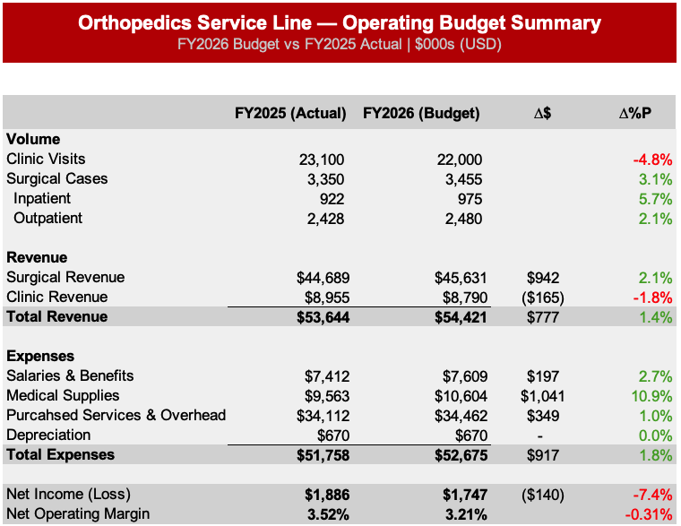
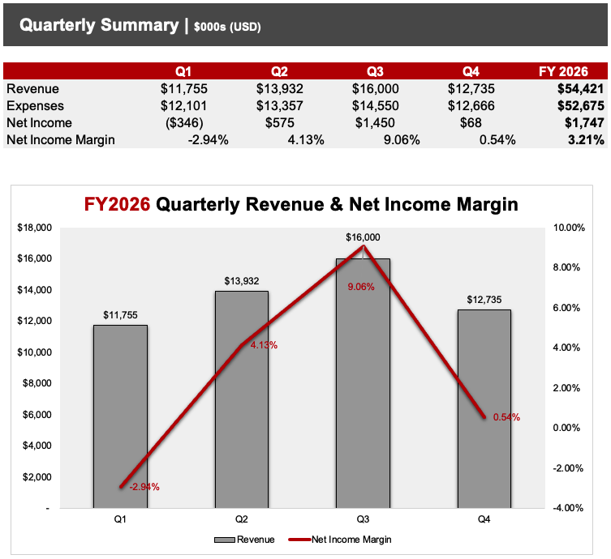
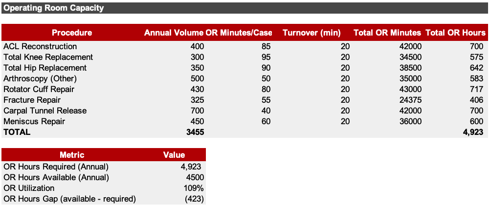
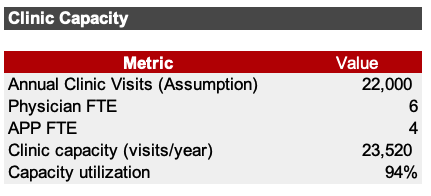
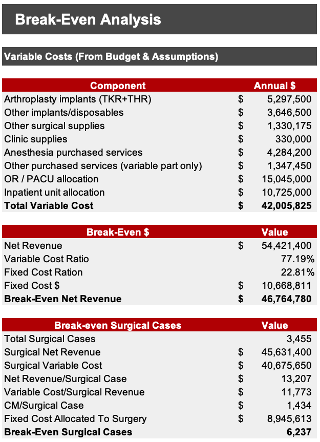
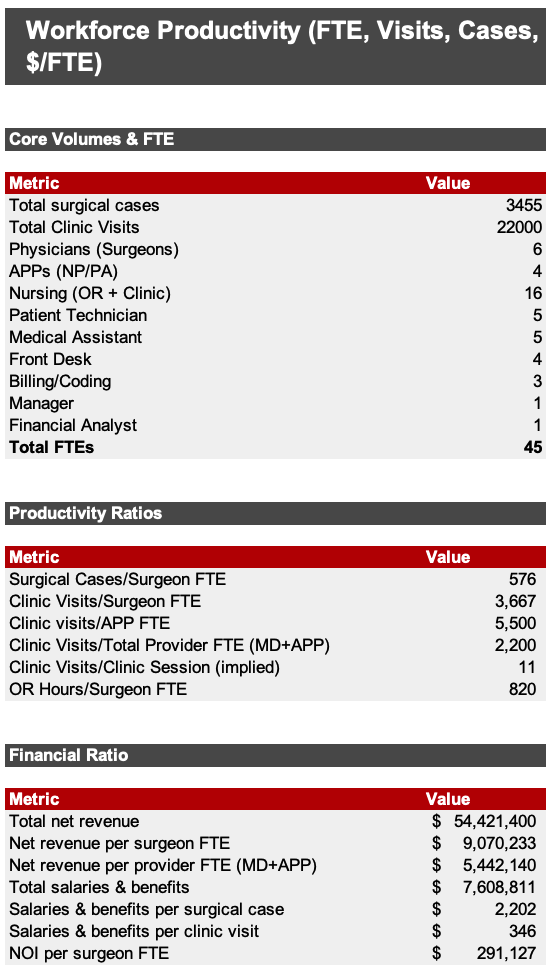
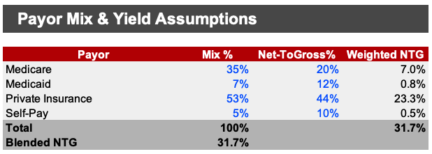

# Orthopedics Service Line Budget & Performance Model (HOPD)
FY2026 Budget vs FY2025 Actual | Margin, Capacity, Break-Even, Productivity & Payor Mix  

## Executive Summary

This project is a driver-based operating budget and performance model for an Orthopedics hospital outpatient department (HOPD). The goal is to show how the service line’s financial performance is created (or lost) through a small set of core drivers—surgical and clinic volumes, payor yield (net-to-gross), cost behavior (variable vs fixed), and operational capacity constraints. Instead of treating the budget as a static set of totals, the model is designed to “explain” the totals and make them usable for decision-making.

The FY2026 budget projects total net revenue of $54.4M, up 1.4% versus FY2025 actuals, while total operating expenses rise 1.8% to $52.7M. That small mismatch is enough to compress profitability: net operating income declines from $1.89M to $1.75M and the operating margin falls from 3.52% to 3.21%. The model makes it clear that this is not a revenue problem—it is primarily a cost and throughput problem. Surgical volume grows, and surgical revenue increases, but medical supplies rise sharply (+10.9%, +$1.04M), consuming most of the incremental revenue and pushing the budgeted margin lower.

Operationally, the budget also carries an important warning: the plan requires more OR time than the assumed capacity. Total OR hours required (4,923) exceed available OR hours (4,500), implying utilization of 109% and a shortfall of 423 hours per year. In other words, the service line is budgeting growth in cases without fully budgeting the operational capacity required to deliver that growth under the current assumptions (case time + turnover). This gap is the kind of issue that usually shows up later as overtime, delays, staffing stress, or lost volume—so surfacing it in the budget stage is one of the main reasons this model exists.

Finally, the procedure-level margin view shows that profitability is concentrated and uneven once costs and facility allocation assumptions are applied. Some procedures generate large positive contribution after allocation, while others become meaningfully negative. This matters because the OR is constrained: when capacity is tight, “what you fill the room with” becomes a financial decision as much as a scheduling decision.

## What the Model Includes (and why it matters)

The model starts with a traditional budget summary—volumes, revenue, expenses, and margin—then breaks the service line into the pieces that actually drive those totals.

A procedure margin module calculates net revenue per case and per-procedure contribution margin by explicitly modeling variable cost components such as implants, supplies, and purchased services. It then applies facility allocation assumptions to produce a fully loaded margin view. This is not meant to be a perfect cost accounting system; it is meant to be a practical way to compare procedures consistently using the same logic, so that discussions about growth, OR block allocation, and cost reduction can be grounded in numbers.

The capacity module translates the same case volumes into OR minutes, adds turnover time, and converts that into total OR hours required. This connects the financial plan to the operational reality: if the OR is already over 100% utilized on paper, then the margin you budgeted may not be achievable without operational improvement or additional capacity. The clinic side is also included to show whether physician/APP clinic sessions and visit targets can support the planned volume.

The break-even module separates variable costs from fixed costs and calculates the revenue level where the service line breaks even. This allows the budget to be evaluated as a risk position. If volume falls, if payor yield softens, or if supply costs inflate further, the model can show how much downside the budget can tolerate before profitability disappears.

The productivity module translates volume into output per FTE (cases per surgeon, visits per provider, OR hours per surgeon) and connects staffing to financial productivity (net revenue per surgeon FTE, NOI per surgeon FTE). This makes it easier to discuss performance in the same language used by finance and operations leadership.

The payor mix and yield module treats net-to-gross as a first-class assumption rather than an afterthought. It calculates the blended net-to-gross based on mix and payor-specific yield, then uses that to translate gross charges into net revenue. This makes it straightforward to run “yield scenarios” and understand how sensitive the service line is to contract performance, denials, and documentation/coding quality.

## Findings and Interpretation (FY2026 vs FY2025)

The top-level story is that FY2026 is a growth budget with weaker profitability. Total revenue rises by $0.78M, but total expenses rise by $0.92M. The most important line item is medical supplies, which increases by $1.04M (10.9%). When one cost category grows faster than the entire revenue growth, it becomes the defining driver of NOI, and that is exactly what happens here. Salaries and benefits rise at a moderate pace (+2.7%), purchased services and overhead rise modestly (+1.0%), and depreciation is flat; supplies dominate the variance.

The volume mix reinforces that story. Surgical cases increase from 3,350 to 3,455 (+3.1%), while clinic visits decline from 23,100 to 22,000 (-4.8%). The budget therefore becomes more dependent on surgical economics: higher case volume drives more surgical revenue (up $0.94M), which offsets a small decline in clinic revenue (-$0.17M). This is a common pattern in orthopedics—surgery supports the financial engine—so it makes the supply/implant cost pressure even more important, because implants and OR-related consumables are exactly where cost risk tends to concentrate.

## Quarterly View (FY2026)

Quarterly phasing shows the service line is not evenly profitable throughout the year. Q3 is very strong (9.06% margin), while Q1 is negative (-2.94%) and Q4 is near break-even (0.54%). This pattern matters because fixed costs and staffing do not fall simply because volume is lower in a quarter. If the organization cares about predictable performance (and most do), then operational planning and block scheduling should reduce the “weak quarter” effect, or at least acknowledge it as part of the financial risk profile.

## Capacity (the plan has to fit in the system)

The most actionable insight from the operational side is that the FY2026 plan, as modeled, does not fit inside the assumed OR capacity. Required OR hours are 4,923 versus available 4,500, meaning the plan is short by 423 hours per year. That is roughly 8.5 OR hours per week, which is effectively another full OR day every week depending on how blocks are structured.

This is where budgets often fail in the real world: the finance plan assumes growth, but the operational plan assumes status quo throughput. If you don’t reconcile these two, the “gap” shows up later as overtime, staffing tension, delayed cases, and lower patient access. The model forces that reconciliation early. It also makes it clear that throughput improvement is not cosmetic—it is financial. Even modest reductions in turnover minutes per case can reclaim hundreds of hours per year at this scale, which can be the difference between meeting the plan versus missing it.

On the clinic side, the model shows the system is not constrained. Planned clinic visits (22,000) sit below estimated clinic capacity (23,520), implying 94% utilization. That means the immediate bottleneck isn’t clinic capacity; it’s OR throughput and cost per case. It also means there is room to stabilize overall performance by protecting/expanding clinic access without adding new provider capacity immediately, depending on session structure and operational realities.

## Break-Even & Risk

The break-even module reframes the budget as a risk position by separating variable costs from fixed costs. With total variable costs around $42.0M and fixed costs around $10.7M, the service line’s contribution margin ratio is roughly 22.8%. The implied break-even net revenue is ~$46.8M versus the FY2026 plan of $54.4M, which provides cushion, but not immunity.

This matters because orthopedics is highly sensitive to yield and supply cost inflation. A relatively small deterioration in reimbursement realization (net-to-gross) or a continued supply increase can erase operating income quickly. For that reason, break-even is not just a finance output—it is a practical way to decide what risks need active monitoring during the year.

## Workforce Productivity

The productivity module translates the FY2026 plan into operational output per FTE and connects staffing to financial productivity. It shows cases per surgeon, visits per provider, implied visits per clinic session, and OR hours per surgeon, then converts that into $/FTE metrics such as net revenue per surgeon and NOI per surgeon. This is useful for benchmarking and for explaining performance to leadership in a language that combines operations and finance.

Because the OR is already modeled above 100% utilization, the most important takeaway is that productivity performance is tied less to adding headcount and more to throughput and unit cost. If throughput improves and variable cost per case is controlled, the same staffing structure becomes much more profitable.

## Payor Mix & Yield

The payor mix and yield module makes reimbursement realization explicit. Surgical economics are heavily driven by yield assumptions: gross charges are translated into net revenue using payor mix and payor-specific net-to-gross. In this model, the blended surgical net-to-gross is 31.7%, with private insurance representing the majority of the mix. The point of showing this in the model is sensitivity: when gross charges are large, small changes in realization move net revenue by meaningful amounts relative to NOI.

This is why “yield” belongs next to “volume” in any orthopedics performance discussion. Improving documentation/coding, reducing denials, ensuring clean charge capture, and actively managing contract terms can be worth more than incremental volume when OR capacity is already tight.

